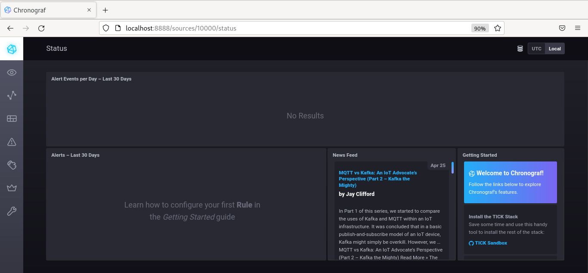

**1.** _Опишите основные плюсы и минусы pull и push систем мониторинга._  

**Push-модель**:  
Плюсы:  
* Упрощение репликации данных в разные системы мониторинга или их 
резервные копии;  
* Более гибкая настройка отправки пакетов данных с метрик;  
* UDP является менее затратным способом передачи данных, вследствии 
чего может вырасти производительность сбора метрик.  

Минусы:  
* Необходимость агентов;  
* Необходимость организации очередей входящих данных на центральном 
узле при большом количестве агентов.  

**Pull-модель**:  
Плюсы:  
* Можно настроить единый proxy-server до всех агентов с TLS;
* Упрощенная отладка получения данных с агентов;  
* Легче контролировать подлинность данных.  

Минусы:  
* Высокая нагрузка на центральный узел;  
* Единая точка отказа в виде центрального сервера;  
* Необходимость знать актуальные адреса всех хостов, которых может 
быть очень много.
***

**2.** _Какие из ниже перечисленных систем относятся к push модели, 
а какие к pull? А может есть гибридные?_  

**Prometheus** - Pull (Push с Pushgateway);  
**TICK** - Push;  
**Zabbix** - Push (Pull с Zabbix Proxy);  
**VictoriaMetrics** - Push/Pull, зависит от источника;  
**Nagios** - Pull.  

***
**3.** _Склонируйте себе репозиторий и запустите TICK-стэк, используя 
технологии docker и docker-compose. В виде решения на это упражнение 
приведите выводы команд:_  

```commandline
[root@fedora sandbox]# curl http://localhost:8086/ping
[root@fedora sandbox]# curl http://localhost:8888
<!DOCTYPE html><html><head><meta http-equiv="Content-type" content="text/html; charset=utf-8"><title>Chronograf</title><link rel="icon shortcut" href="/favicon.fa749080.ico"><link rel="stylesheet" href="/src.9cea3e4e.css"></head><body> <div id="react-root" data-basepath=""></div> <script src="/src.a969287c.js"></script> </body></html>
[root@fedora sandbox]# curl http://localhost:9092/kapacitor/v1/ping
[root@fedora sandbox]#
```
_А также скриншот веб-интерфейса ПО chronograf (http://localhost:8888)_:  
  
***
**4.** _Для выполнения задания приведите скриншот с отображением метрик 
утилизации места на диске (disk->host->telegraf_container_id) из 
веб-интерфейса_:  


***
**5.** _Добавьте в конфигурацию telegraf следующий плагин - docker_:  

