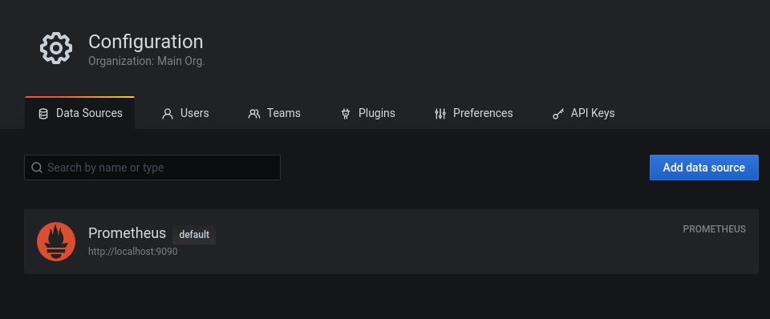
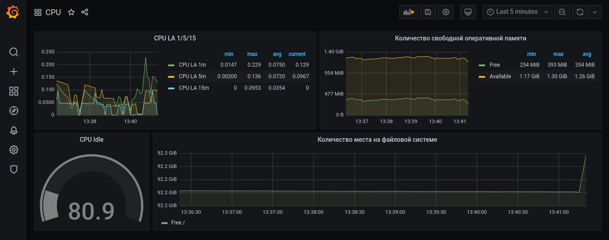
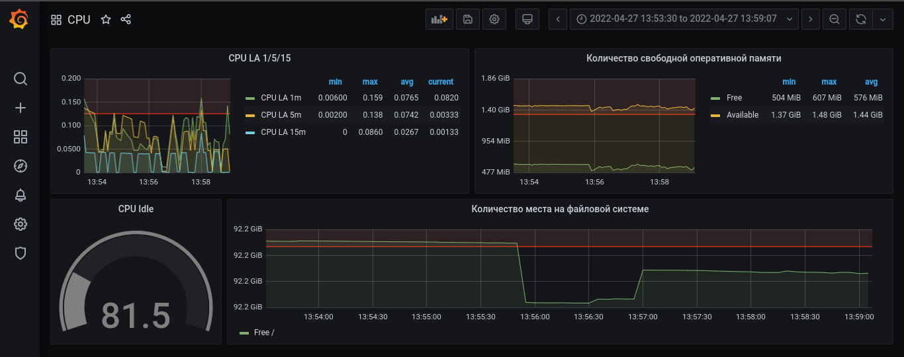

**1.** _Cкриншот веб-интерфейса grafana со списком подключенных Datasource:_  



***
**2.** _Приведите promql запросы для выдачи этих метрик, а также скриншот 
получившейся Dashboard:_  
Утилизация CPU для nodeexporter (в процентах, 100-idle):  
```commandline
avg by(instance)(rate(node_cpu_seconds_total{job="nodeexporter",mode="idle"}[$__rate_interval])) * 100
```
CPULA 1/5/15
```commandline
avg by (instance)(rate(node_load1{}[$__rate_interval]))
avg by (instance)(rate(node_load5{}[$__rate_interval]))
avg by (instance)(rate(node_load15{}[$__rate_interval]))
```
Количество свободной оперативной памяти
```commandline
avg(node_memory_MemFree_bytes{instance="nodeexporter:9100",job="nodeexporter"})
avg(node_memory_MemAvailable_bytes{instance="nodeexporter:9100", job="nodeexporter"})
```
Количество места на файловой системе
```commandline
node_filesystem_free_bytes{instance="nodeexporter:9100",job="nodeexporter",mountpoint="/"}
```


***
**3.** _Создайте для каждой Dashboard подходящее правило alert. 
Приложите скриншот вашей итоговой Dashboard:_  

  

***
**4.** _Сохраните ваш Dashboard. Приведите листинг этого файла:_ 

[my_dashboard.json](my_dashboard.json)