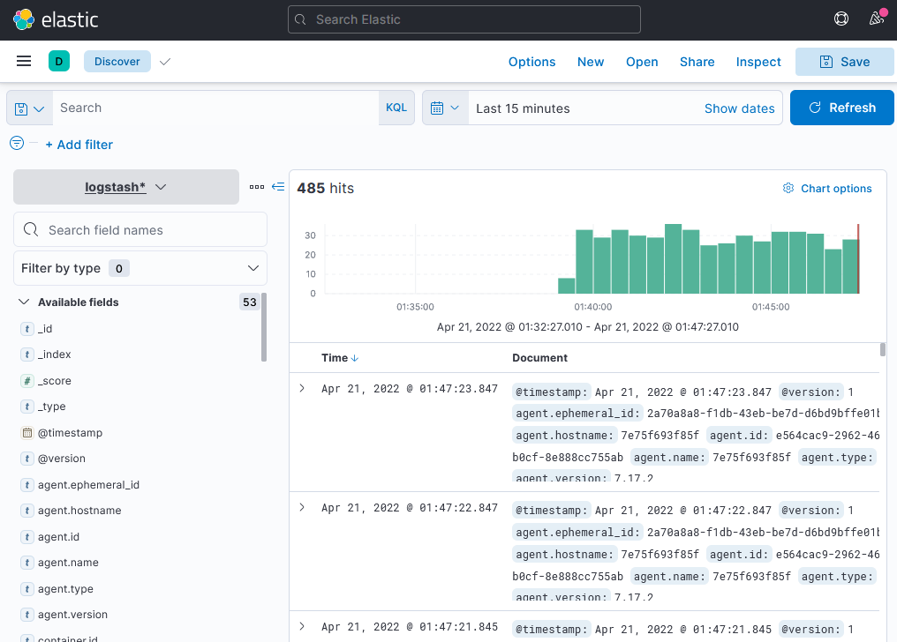
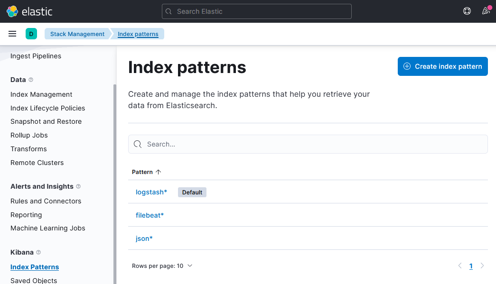
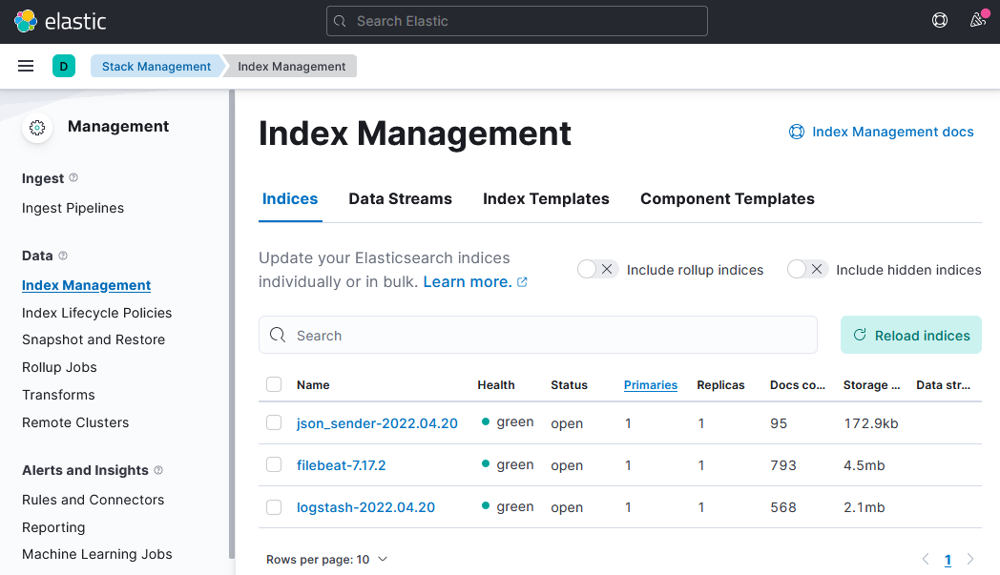

**1.** _Cкриншот `docker ps`_:  
```commandline
[root@node-01 help]# docker-compose ps
  Name                Command               State                              Ports                            
----------------------------------------------------------------------------------------------------------------
es-hot     /bin/tini -- /usr/local/bi ...   Up      0.0.0.0:9200->9200/tcp,:::9200->9200/tcp, 9300/tcp          
es-warm    /bin/tini -- /usr/local/bi ...   Up      9200/tcp, 9300/tcp                                          
filebeat   /usr/bin/tini -- /usr/loca ...   Up                                                                  
kibana     /bin/tini -- /usr/local/bi ...   Up      0.0.0.0:5601->5601/tcp,:::5601->5601/tcp                    
logstash   /usr/local/bin/docker-entr ...   Up      5044/tcp, 0.0.0.0:5046->5046/tcp,:::5046->5046/tcp, 9600/tcp
some_app   python3 /opt/run.py              Up                                               
```

_Cкриншот интерфейса kibana:_  


***
**2.**  _Cоздание index-patterns в kibana:_  

