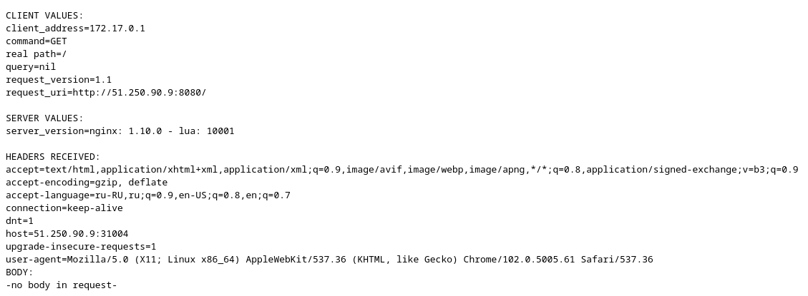

### _Установить Minikube_  

* проверить версию можно командой `minikube version`
```commandline
root@node-01:/home/ubuntu# minikube version
minikube version: v1.25.2
commit: 362d5fdc0a3dbee389b3d3f1034e8023e72bd3a7
```
* переключаемся на root и запускаем миникуб: 
`minikube start --vm-driver=none`  
```commandline
root@node-01:~# minikube start --vm-driver=none
😄  minikube v1.25.2 on Ubuntu 20.04 (amd64)
✨  Using the none driver based on user configuration
👍  Starting control plane node minikube in cluster minikube
🤹  Running on localhost (CPUs=8, Memory=16008MB, Disk=50349MB) ...
ℹ️  OS release is Ubuntu 20.04.4 LTS
🐳  Preparing Kubernetes v1.23.3 on Docker 20.10.16 ...
    ▪ kubelet.resolv-conf=/run/systemd/resolve/resolv.conf
    ▪ kubelet.housekeeping-interval=5m
    > kubectl.sha256: 64 B / 64 B [--------------------------] 100.00% ? p/s 0s
    > kubelet.sha256: 64 B / 64 B [--------------------------] 100.00% ? p/s 0s
    > kubeadm.sha256: 64 B / 64 B [--------------------------] 100.00% ? p/s 0s
    > kubeadm: 43.12 MiB / 43.12 MiB [-----------] 100.00% 276.32 MiB p/s 400ms
    > kubectl: 44.43 MiB / 44.43 MiB [-------------] 100.00% 55.32 MiB p/s 1.0s
    > kubelet: 118.75 MiB / 118.75 MiB [-----------] 100.00% 74.96 MiB p/s 1.8s
    ▪ Generating certificates and keys ...
    ▪ Booting up control plane ...
    ▪ Configuring RBAC rules ...
🤹  Configuring local host environment ...

❗  The 'none' driver is designed for experts who need to integrate with an existing VM
💡  Most users should use the newer 'docker' driver instead, which does not require root!
📘  For more information, see: https://minikube.sigs.k8s.io/docs/reference/drivers/none/

❗  kubectl and minikube configuration will be stored in /root
❗  To use kubectl or minikube commands as your own user, you may need to relocate them. For example, to overwrite your own settings, run:

    ▪ sudo mv /root/.kube /root/.minikube $HOME
    ▪ sudo chown -R $USER $HOME/.kube $HOME/.minikube

💡  This can also be done automatically by setting the env var CHANGE_MINIKUBE_NONE_USER=true
🔎  Verifying Kubernetes components...
    ▪ Using image gcr.io/k8s-minikube/storage-provisioner:v5
🌟  Enabled addons: default-storageclass, storage-provisioner
🏄  Done! kubectl is now configured to use "minikube" cluster and "default" namespace by default
```
* после запуска стоит проверить статус: `minikube status`  
```commandline
root@node-01:~# minikube status
minikube
type: Control Plane
host: Running
kubelet: Running
apiserver: Running
kubeconfig: Configured
```
* запущенные служебные компоненты можно увидеть командой: 
`kubectl get pods --namespace=kube-system`  
```commandline
root@node-01:~# kubectl get pods --namespace=kube-system
NAME                              READY   STATUS    RESTARTS   AGE
coredns-64897985d-n2975           1/1     Running   0          115s
etcd-node-01                      1/1     Running   0          2m7s
kube-apiserver-node-01            1/1     Running   0          2m7s
kube-controller-manager-node-01   1/1     Running   0          2m7s
kube-proxy-8d89c                  1/1     Running   0          115s
kube-scheduler-node-01            1/1     Running   0          2m7s
storage-provisioner               1/1     Running   0          2m5s
```
---
### _Запуск Hello World_  
* развернуть через Minikube тестовое приложение  
```commandline
root@node-01:~# kubectl create deployment hello-node --image=k8s.gcr.io/echoserver:1.4
deployment.apps/hello-node created
root@node-01:~# kubectl get deployments
NAME         READY   UP-TO-DATE   AVAILABLE   AGE
hello-node   0/1     1            0           10s
```

* установить аддоны `ingress` и `dashboard`  
```commandline
root@node-01:~# minikube addons list
|-----------------------------|----------|--------------|--------------------------------|
|         ADDON NAME          | PROFILE  |    STATUS    |           MAINTAINER           |
|-----------------------------|----------|--------------|--------------------------------|
| ambassador                  | minikube | disabled     | third-party (ambassador)       |
| auto-pause                  | minikube | disabled     | google                         |
| csi-hostpath-driver         | minikube | disabled     | kubernetes                     |
| dashboard                   | minikube | enabled ✅   | kubernetes                     |
| default-storageclass        | minikube | enabled ✅   | kubernetes                     |
| efk                         | minikube | disabled     | third-party (elastic)          |
| freshpod                    | minikube | disabled     | google                         |
| gcp-auth                    | minikube | disabled     | google                         |
| gvisor                      | minikube | disabled     | google                         |
| helm-tiller                 | minikube | disabled     | third-party (helm)             |
| ingress                     | minikube | enabled ✅   | unknown (third-party)          |
| ingress-dns                 | minikube | disabled     | google                         |
| istio                       | minikube | disabled     | third-party (istio)            |
| istio-provisioner           | minikube | disabled     | third-party (istio)            |
| kong                        | minikube | disabled     | third-party (Kong HQ)          |
| kubevirt                    | minikube | disabled     | third-party (kubevirt)         |
| logviewer                   | minikube | disabled     | unknown (third-party)          |
| metallb                     | minikube | disabled     | third-party (metallb)          |
| metrics-server              | minikube | disabled     | kubernetes                     |
| nvidia-driver-installer     | minikube | disabled     | google                         |
| nvidia-gpu-device-plugin    | minikube | disabled     | third-party (nvidia)           |
| olm                         | minikube | disabled     | third-party (operator          |
|                             |          |              | framework)                     |
| pod-security-policy         | minikube | disabled     | unknown (third-party)          |
| portainer                   | minikube | disabled     | portainer.io                   |
| registry                    | minikube | disabled     | google                         |
| registry-aliases            | minikube | disabled     | unknown (third-party)          |
| registry-creds              | minikube | disabled     | third-party (upmc enterprises) |
| storage-provisioner         | minikube | enabled ✅   | google                         |
| storage-provisioner-gluster | minikube | disabled     | unknown (third-party)          |
| volumesnapshots             | minikube | disabled     | kubernetes                     |
|-----------------------------|----------|--------------|--------------------------------|
```
---
### Установить kubectl
* подключиться к `minikube`  
```commandline
[root@fedora ~]# kubectl cluster-info
Kubernetes control plane is running at https://51.250.90.9:8443
CoreDNS is running at https://51.250.90.9:8443/api/v1/namespaces/kube-system/services/kube-dns:dns/proxy

To further debug and diagnose cluster problems, use 'kubectl cluster-info dump'.
[root@fedora ~]# kubectl get node
NAME      STATUS   ROLES                  AGE   VERSION
node-01   Ready    control-plane,master   26m   v1.23.3
```
* проверить работу приложения из задания 2,
запустив `port-forward` до кластера  
```commandline
  [root@fedora ~] curl http://51.250.90.9:8080
  CLIENT VALUES:
  client_address=127.0.0.1
  command=GET
  real path=/
  query=nil
  request_version=1.1
  request_uri=http://51.250.90.9:8888/

  SERVER VALUES:
  server_version=nginx: 1.10.0 - lua: 10001

  HEADERS RECEIVED:
  accept=*/*
  host=51.250.90.9:8080
  user-agent=curl/7.68.0
  BODY:
  -no body in request-
```