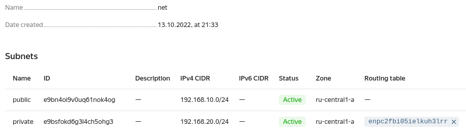
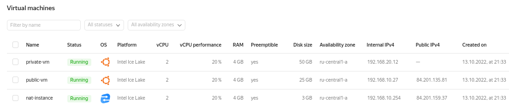

### Задание 1. Яндекс.Облако (обязательное к выполнению)  
1. Cоздаем манифест для сети, где описываем следующие моменты:  
* vpc subnet с названием public, сетью 192.168.10.0/24;  
* vpc subnet с названием private, сетью 192.168.20.0/24;
* создать route table, добавить статический маршрут, 
направляющий весь исходящий трафик private сети в NAT-инстанс.  

Манифест [network.tf](terra/network.tf)  
Результат создания:  
  
2. Создаем манифесты виртуальных машин и NAT-инстанса:  
* NAT-инстанс, присвоив ему адрес 192.168.10.254;  
* в публичной подсети виртуалку с публичным IP;  
* в приватной подсети виртуалку с внутренним IP.  

Приватная ВМ - [private-vm.tf](terra/private-vm.tf)  
Публичная ВМ - [public-vm.tf](terra/public-vm.tf)  
NAT-инстанс - [nat-instance.tf](terra/nat-instance.tf)  
Результат создания:  
  
3. Выполним проверки:  
* подключимся к виртуалке с публичным IP и убедиться что есть доступ 
к интернету;  
* подключимся к виртуалке с внутренним IP через виртуалку созданную 
ранее и убедимся что есть доступ к интернету.  
```commandline
[root@nb-5583 jekis_]# ssh 84.201.135.81 -l ubuntu
Warning: Permanently added '84.201.135.81' (ED25519) to the list of known hosts.
Welcome to Ubuntu 20.04.4 LTS (GNU/Linux 5.4.0-121-generic x86_64)

 * Documentation:  https://help.ubuntu.com
 * Management:     https://landscape.canonical.com
 * Support:        https://ubuntu.com/advantage
 ubuntu@public-vm:~$ ping ya.ru
PING ya.ru (87.250.250.242) 56(84) bytes of data.
64 bytes from ya.ru (87.250.250.242): icmp_seq=1 ttl=59 time=0.538 ms
64 bytes from ya.ru (87.250.250.242): icmp_seq=2 ttl=59 time=0.277 ms
^C
--- ya.ru ping statistics ---
2 packets transmitted, 2 received, 0% packet loss, time 1001ms
rtt min/avg/max/mdev = 0.277/0.407/0.538/0.130 ms
ubuntu@public-vm:~$ ssh 192.168.20.12
Warning: Permanently added '192.168.20.12' (ECDSA) to the list of known hosts.
Welcome to Ubuntu 20.04.4 LTS (GNU/Linux 5.4.0-121-generic x86_64)

 * Documentation:  https://help.ubuntu.com
 * Management:     https://landscape.canonical.com
 * Support:        https://ubuntu.com/advantage
ubuntu@private-vm:~$ ping ya.ru
PING ya.ru (87.250.250.242) 56(84) bytes of data.
64 bytes from ya.ru (87.250.250.242): icmp_seq=1 ttl=57 time=1.10 ms
64 bytes from ya.ru (87.250.250.242): icmp_seq=2 ttl=57 time=0.792 ms
^C
--- ya.ru ping statistics ---
2 packets transmitted, 2 received, 0% packet loss, time 1001ms
rtt min/avg/max/mdev = 0.792/0.944/1.096/0.152 ms
```